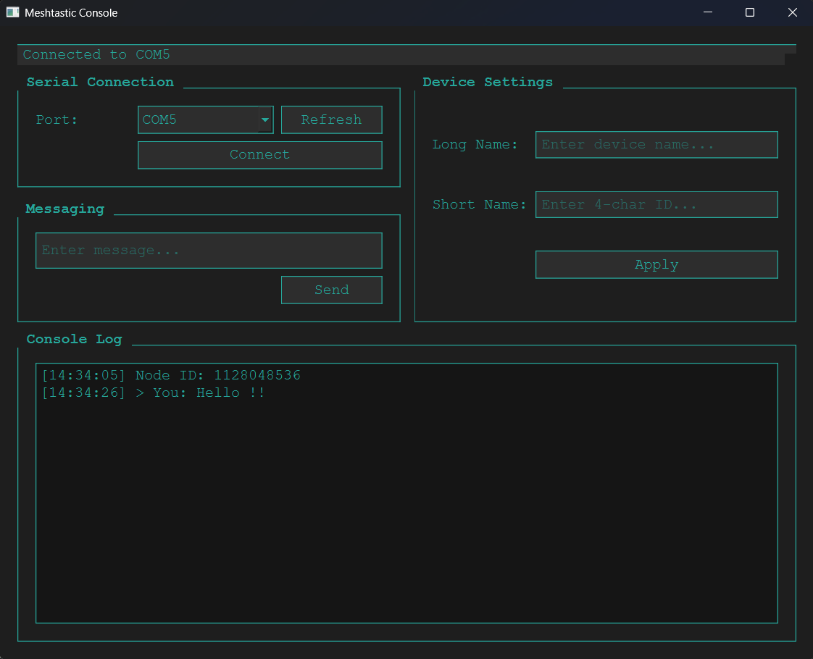

# Meshtastic GUI

A Python-based GUI application for interacting with Meshtastic devices, built using PyQt6 and the Meshtastic Python API. This project aims to provide a user-friendly desktop alternative to the official Meshtastic clients, offering the same functionality as the iOS, Android, and web clients—but in an offline-capable, native desktop form.

---

## ⚠️ Current Status

> 💡 Incoming messages are currently only visible in the debug terminal and **do not yet show up in the GUI**. This is a known issue and being actively worked on.

This project is still under development and will continue evolving with feedback and feature requests. Built with the help of Large Language Models (LLMs) to kickstart implementation—refinements are ongoing.

---

## 🚀 Project Goals

The primary goal of this project is to provide a full-featured, offline-capable desktop client with the same power as the official Meshtastic mobile and web apps.

### Core Objectives

- Offline-first functionality (no internet required)
- Full feature parity with official clients
- Native Windows & Linux support
- Clean, modern, and themeable UI
- All core Meshtastic functions:
  - Messaging (real-time & historical)
  - Node visibility and management
  - Channel setup and switching
  - Device setting tweaks
  - Map views for nodes (planned)
  - Offline message storage
  - Advanced configuration panels

### UI Goals

- Multiple built-in themes: Light, Dark, High Contrast
- Full color/font/layout customization

---

## 🧪 Getting Started

### Requirements

- Python 3.x
- PyQt6
- Meshtastic Python API
- pyserial

### Installation

```bash
git clone https://github.com/axlixr/Meshtastic-Desktop-Application.git
cd Meshtastic-Desktop-Application
pip install -r requirements.txt
```

### Running the App

```bash
python main.py
```

1. Select your device’s serial port from the dropdown
2. Click **Connect**
3. Type a message and press **Send**
4. Use the side panel for device settings

---

## 🔧 Features

- Serial port auto-detection & management
- Real-time message sending
- Device name customization
- Console log for debug visibility
- Clean dark UI with teal accents
- Future support for custom themes

---

## 🗘️ Roadmap

- [x] Serial port connection
- [x] Device naming
- [x] Message sending
- [ ] Bluetooth Connection
- [ ] GUI message reception
- [ ] Message history storage
- [ ] Channel & node management UI
- [ ] Map-based node display
- [ ] Full theme customization system

---

## 🗈️ Preview



---

## 🤝 Contributing

Pull requests welcome! Whether it's bug fixes, feature ideas, UI tweaks, or theme contributions—feel free to jump in.

---

## 🧠 Development Notes

This project was rapidly prototyped using help from LLMs for code scaffolding and early UI structure. All features are being refined and validated manually—community testing is appreciated!

---

## 📄 License

Licensed under the **GNU GENERAL PUBLIC LICENSE** – see the `LICENSE` file for details.

---

## 🙏 Acknowledgments

- [Meshtastic](https://meshtastic.org/) – for the open-source mesh network magic
- [PyQt6](https://www.riverbankcomputing.com/software/pyqt/) – for the GUI framework
- [The Meshtastic Python CLI](https://meshtastic.org/docs/software/python/cli/) – for foundational device communication
- Open-source community contributors ❤️

---

## ✍️ Authors

Add your name or handle below if you’ve contributed to this project:

- 🛠️ **Axl** – Creator & Lead Dev  
- ✨ _(Add yourself here!)_

---

